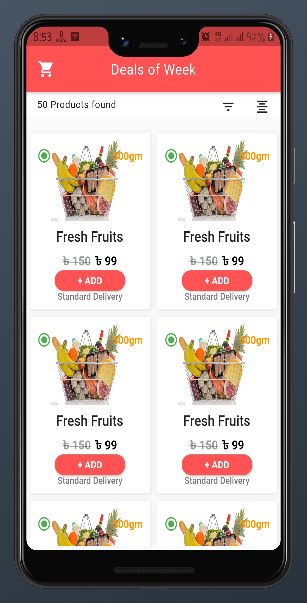
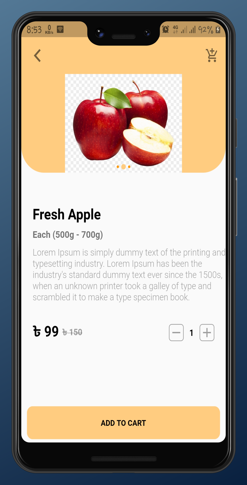

# Grocery App UI Using Flutter
This is a beautiful grocery app UI created by using Flutter for beginners or pro.

# Feel free to use in your project
# Don't forget to star the repo and follow me

      

## Getting Started

- Clone or download the project.
- run : flutter pub get
- run : flutter run --release

This project is a starting point for a Flutter application.

A few resources to get you started if this is your first Flutter project:

- [Lab: Write your first Flutter app](https://flutter.dev/docs/get-started/codelab)
- [Cookbook: Useful Flutter samples](https://flutter.dev/docs/cookbook)

For help getting started with Flutter, view our
[online documentation](https://flutter.dev/docs), which offers tutorials,
samples, guidance on mobile development, and a full API reference.
